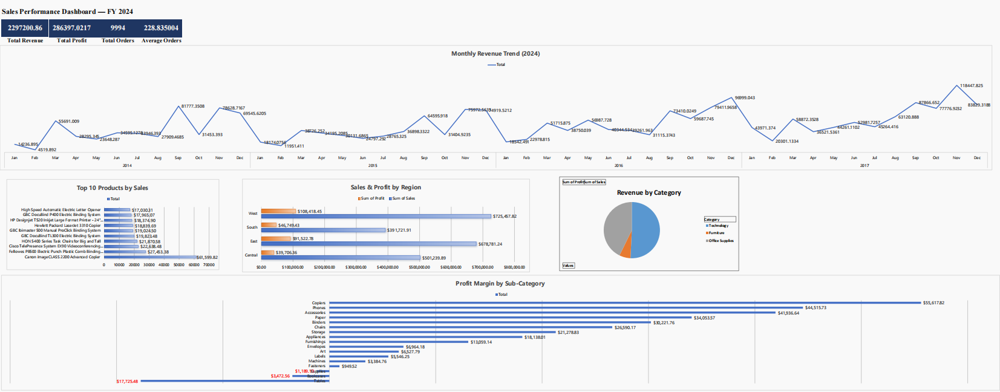

# Superstore Sales Performance Dashboard

## Project Overview
A complete sales analytics project analyzing the Superstore dataset
to identify revenue trends, top-performing products, regional opportunities,
and profit leakage — presented as a client-ready dashboard.

## Key Business Findings
- Technology drives the highest revenue (37% of total sales)
- South region shows the highest growth rate and is currently under-served
- Tables sub-category has a negative profit margin due to excessive discounting
- November–December accounts for 28% of annual revenue (seasonal peak)

## Strategic Recommendations
1. Cap Tables discounts at 15% to recover $18K–22K annual profit
2. Allocate more sales resources to the South region
3. Launch Technology + Furniture bundle offers to raise average order value
4. Run Q1 promotions to reduce the seasonal revenue dip

## Tools Used
- WPS Office (Excel-compatible pivot tables, charts, and dashboard)
- Dataset: Superstore Sales Dataset (Kaggle)

## Files in This Repository
| File | Description |
|------|-------------|
| Superstore_Sales_Dashboard.xlsx | Full workbook with raw data, pivot tables, and dashboard |
| Superstore_Dashboard.pdf | Client-ready one-page dashboard PDF |
| Superstore_Insights.pdf | Written insights and recommendations |

## Dashboard Preview

## How to Use
1. Download the .xlsx file
2. Open in Excel or WPS Office
3. Navigate to the Dashboard tab for the visual summary
4. Navigate to Insights & Recommendations for written analysis

